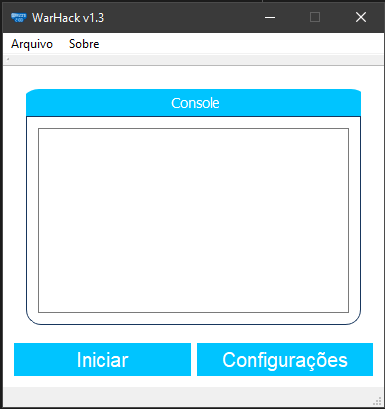
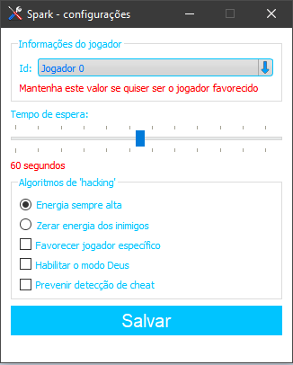
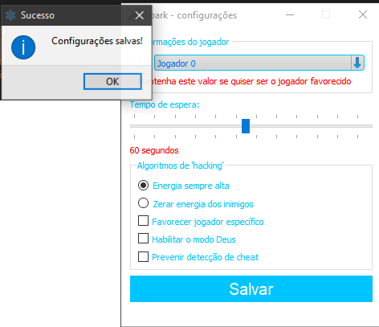
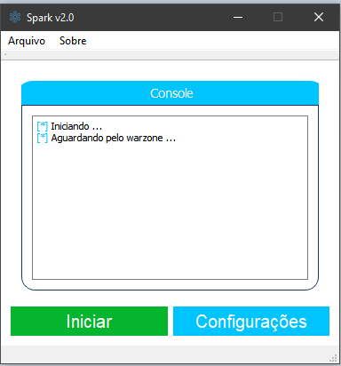
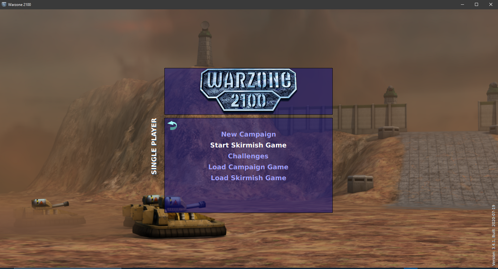
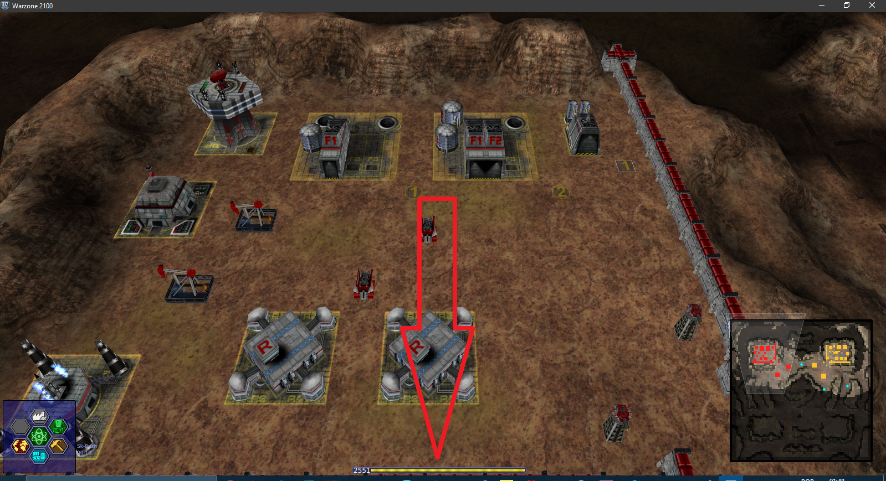
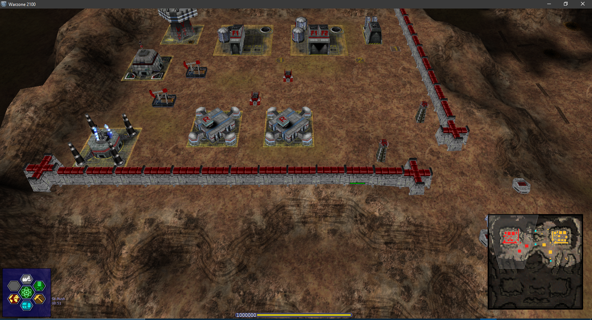

# Como utilizar o Spark

 

### 1. Abra o Spark e clique em **Configurações**

 
 

   

### 2. Faça a configuração desejada
- Neste caso, iremos configurar o hack para que o jogador 0 sempre receba o valor máximo de energia a cada 60 segundos.

 

### 3. Salve as configurações
 

### 4. Aperte em iniciar
 

- Nessa etapa, o programa irá ficar aguardando pela abertura do warzone 2100. Assim que o warzone 2100 for aberto, as modificações já começarão a ser feitas.

 
 

### 5. Abra o warzone 2100 e jogue normalmente

 
 

### ATENÇÃO: você corre risco de ser banido dos servidores caso use este programa no modo multiplayer online!

 
 